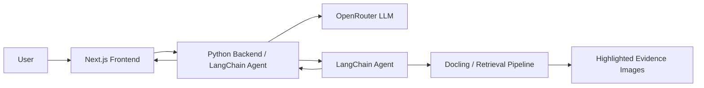

# Frontend Framework Decision

## Recommendation

Use **Next.js with React, TypeScript, App Router, Tailwind CSS, shadcn/ui, TanStack Query, and Zustand**.

This frontend is an operational agent workspace: one focused query input, one answer surface, and visual evidence from Docling. It does not need marketing pages, heavy SSR, or realtime streaming. Next.js is still the best default because it gives a stable React foundation, routing, deployment ergonomics, image handling, and an optional Backend-for-Frontend layer if the Python backend needs proxying or auth later.

## Why Next.js

- **React ecosystem fit:** mature component ecosystem for audio recording, document viewers, canvas overlays, and keyboard-first workflows.
- **App Router:** good structure for an application shell with nested routes such as query history, runs, documents, and result inspection.
- **Route Handlers as optional BFF:** useful if the browser should never talk directly to the Python backend, or if auth/session handling later moves partly into the frontend host.
- **No streaming required:** the app can use plain mutations and polling-free request/response flows.
- **Deployability:** easy on Vercel, Docker, or as a static-ish UI served beside the Python API.

## Why Not Plain Vite

Vite + React would also work and is simpler. I would choose it if the app stays a single internal screen with no auth, no server-side concerns, and no route-level data needs. For this project, the likely next features are history, document detail views, auth, and run inspection, so Next.js gives more room without a rewrite.

## Recommended Stack

| Concern | Choice | Reason |
| --- | --- | --- |
| Framework | Next.js App Router | Structured app shell, routes, optional BFF |
| Language | TypeScript | Shared DTOs with generated API types |
| Styling | Tailwind CSS | Fast, consistent, low ceremony |
| Components | shadcn/ui + Radix primitives | Accessible controls without locking into a closed design system |
| Data fetching | TanStack Query | Excellent mutation states for non-streaming agent runs |
| Client state | Zustand | Small state layer for recorder/input/viewer state |
| Forms | React Hook Form + Zod | Typed validation for text/audio submit flows |
| Icons | lucide-react | Consistent icon buttons for recorder, submit, copy, zoom |
| Image evidence | Native image + SVG/canvas overlay | Precise Docling highlight boxes with zoom/pan |
| Tests | Vitest + Testing Library + Playwright | Unit coverage plus visual interaction coverage |

## Architecture Shape

The browser calls the Python backend directly. OpenRouter keys, LangChain tools, document storage, and Docling processing stay server-side. Browser speech recognition is used for the MVP voice input, so the deployed frontend does not need an ASR secret.

## Frontend Routes

| Route | Purpose |
| --- | --- |
| `/` | Main ask-and-answer workspace |
| `/runs/[runId]` | Optional future deep link to a completed answer and its evidence |
| `/documents/[documentId]` | Optional document/image evidence inspection |
| `/settings` | Optional backend URL/model/debug toggles for hackathon demos |

For the hackathon MVP, `/` is enough.

## Source Notes

- Next.js documents App Router as a file-system router built on React Server Components and supports nested layouts and app structure: https://nextjs.org/docs/app
- Next.js Route Handlers can provide public endpoints for BFF-style requests if needed: https://nextjs.org/docs/app/getting-started/route-handlers
- OpenRouter model ids used by the UI: `openai/gpt-4o-mini` for fast answers and `openai/o3` for stronger reasoning.
